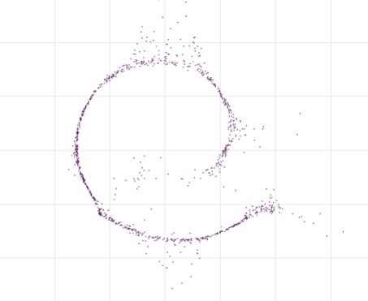
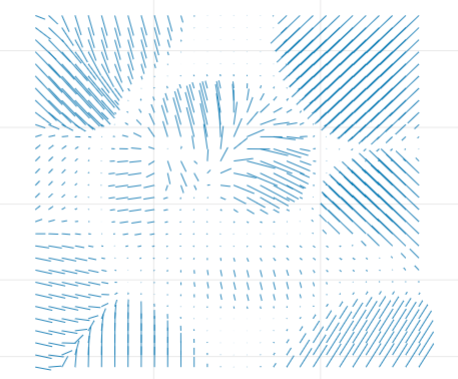
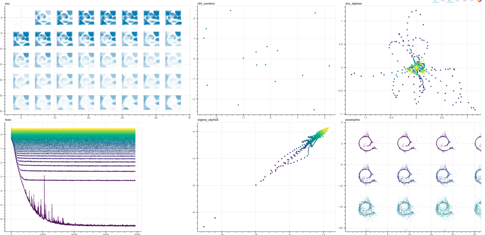

# Diffusion model experiments from Jascha Sohl-Dickstein et al. 2015 paper

This is a PyTorch implementation of https://arxiv.org/pdf/1503.03585.pdf

    pip install git+https://github.com/hrbigelow/diffusion.git

Learning the Swiss Roll distribution using diffusion trained with no mathematical 
analytic simplifications.

Pip requirements:  fire, bokeh, torch

This is an implementation of the swiss roll model from [Sohl-Dickstein et al.
(2015)](https://arxiv.org/pdf/1503.03585.pdf) described in Appendix D.1.1.  

Unlike in the paper, this model is trained using a brute-force Monte-Carlo sampling
procedure to minimize $D[q(x^{t-1}|x^t) || p(x^{t-1} | x^t)]$.  Briefly, this is
possible because $q$ is constant.  Thus, it is possible to minimize this by
minimizing a proxy objective of the NLL.  The full details are explained at
[blog](https://mlcrumbs.com/diffusion)

One example of the learned drift term, displayed here as a vector field.  The
line lengths are actual size - that is, the gridded start points represent $x^t$, and
the end points are $\mu(x^{t-1}) = f(x^t) + x^t$

Here is a view of the full training dashboard.  In plots `mu_alphas`, `loss`, and
`sigma_alphas`, purple represents t=0, while yellow is t=40.  The individual loss
curves are $E_{x^{t-1},x^t)~q} [-log(x^{t-1} | x^t)]$.

